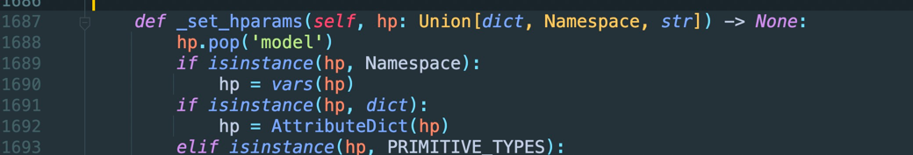

# GCN-tffc

    比较 TCN、GRU、GCN、TGCN、 TCN+GCN 在 交通流量预测方面的准确率效果。

Fork frame from [T-GCN-PyTorch](https://img.shields.io/github/stars/martinwhl/T-GCN-PyTorch)

#  <span id="p6">目录</span>
   -  [环境要求](#p1)
   -  [运行小前奏](#p2)
   -  [模型训练](#p3)
   -  [调参](#p4)
   -  [数据可视化](#p5)

## <span id="p1">环境要求</span>

* numpy
* matplotlib
* pandas
* torch
* pytorch-lightning>=1.3.0
* torchmetrics>=0.3.0
* python-dotenv

```bash
    pip install -r requirements.txt
```

## <span id="p2">运行小前奏</span>

1. 通过 目录下tasks/ supervised.py 25行进入 lighting.py
   
2. 修改工具包文件 lighting.py 1688行, 加入 hp.pop('model')
   
3. 若在服务器，无法通过编译器打开代码，需到 anaconda3/envs/tgcn（自己环境名）/lib/python3.6/site-packages/pytorch_lightning/core/lightning.py 内通过
   vim 编辑,在 1688 行加入 hp.pop('model')

## <span id="p3">模型训练</span>

```bash
  # GCN
  $ python main.py --model_name GCN --max_epochs 3000 --learning_rate 0.001 --weight_decay 0 --batch_size 64 --hidden_dim 100 --settings supervised --gpus 1 --pre_len 1
  # GRU
  $ python main.py --model_name GRU --max_epochs 3000 --learning_rate 0.001 --weight_decay 1.5e-3 --batch_size 64 --hidden_dim 100 --settings supervised --gpus 1 --pre_len 1
  # T-GCN
  $ python main.py --model_name TGCN --max_epochs 3000 --learning_rate 0.001 --weight_decay 0 --batch_size 32 --hidden_dim 64 --loss mse_with_regularizer --settings supervised --gpus 1 --pre_len 1
  # TCN
  $ python main.py --model_name TCN --max_epochs 3000 --learning_rate 0.001 --weight_decay 0 --batch_size 32 --hidden_dim 64 --loss mse --settings supervised --gpus 1 --pre_len 1
  # MSTTGCN
  $ python main.py --model_name MSTTGCN --max_epochs 3000 --learning_rate 0.001 --weight_decay 0 --batch_size 32 --hidden_dim 64 --loss mse --settings supervised --gpus 1 --pre_len 1
```

## <span id="p4">调参(对上一步模型训练命令进行修改)</span>

| 参数名称 | 参数说明 | 输入 |
| ------------ | ------------ | ------------ |
| model_name | 使用模型 |GCN,GRU,TGCN,TCN,MSTTGCN |
| data | 使用数据 |shenzhen, losloop, wenyi, allday |
| split_ratio | 数据集分割率 |默认0.8，即 train:test =8:2 |
| normalize | 数据集是否正则化 |默认True |
| seq_len | 预测的时间跨度 |默认12, 即用12行数据去进行预测|
| pre_len | 被预测的时间跨度 |默认1 即预测之后的一行数据|
| max_epochs | 训练次数 |整数, 自己设置 |
| learning_rate | 学习率 |默认0.001 |
| weight_decay | 权重衰减 |默认0.0015 |
| batch_size | 总训练样本数/一次epoch的训练次数 |合适的batch size范围主要和收敛速度、随机梯度噪音有关。 |
| hidden_dim | 隐藏层维度 |默认64 |
| settings | 训练方法 |默认supervised，监督学习，暂时仅支持监督学习 |
| loss | 损失函数计算 |mse,mse_with_regularizer 暂时支持两种计算方式 |
| gpus | GPU使用数量 |整数 默认不使用 |
| tcn_len | 使用TCN和MSTTGCN时，会用到卷积层，卷积层长度 |默认4 |
| tcn_wid | 使用TCN和MSTTGCN时，会用到卷积层，卷积层维度 |默认10 |
| log_path | 日志地址 |默认 lightning_logs/ |
| email | 训练完或中断是否发送邮件 |需创建.env文件进行配置 |


## <span id="p5">数据可视化</span>

    训练完成后会在 lightning_logs/下生成version_xxx文件，通过命令行运行
    通过地址 http://localhost:6006/ 可进行可视化效果的查看
```bash
   $ tensorboard --logdir lightning_logs/version_0
```

####  邮件地址: 815382636@qq.com

####   [回到顶部](#p6)
